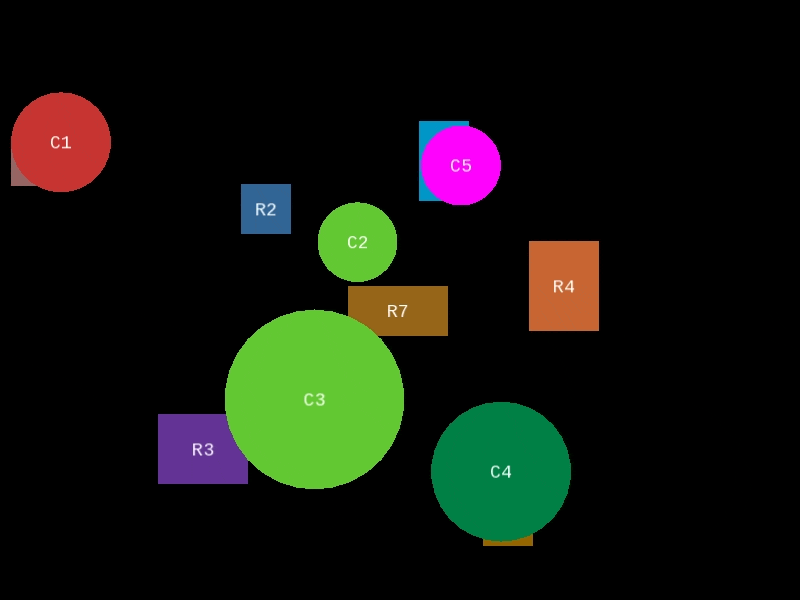

## Practice01
Add window, font, shapes(Rectangle and Circle) by read the configuration file, and add bounce if it touches the edge of the window.



### Running

1. Make sure you have [g++](https://gcc.gnu.org/) (C++ compiler) and [SFML](https://www.sfml-dev.org/) installed on your system. If not, install them first.

2. Open a terminal or command prompt and navigate to the directory where the Makefile and `main.cpp` file are located using `cd`.

3. Run the following command in the terminal to compile:

    ```bash
    make compile
    ```

5. After the command is executed, the result will be stored in a file named `sfmlgame` (as specified by the `-o` option). You can run the compiled program by typing:

    ```bash
    ./sfmlgame
    ```

    Make sure to be in the same directory as the `sfmlgame` file or provide the full path if you are in a different directory.


### Configuration
Configuration files are stored in a file called `config.txt`

Each line of the configration file specifies one of the config settings, with the first string in each line being the type of setting that rest of the line specified. Line in the config file can be one of the following types, and `lines can appear in any order in the file`.

`Window W H`
- This line declares that the SFML Window, `W` and `H` must be int and are numbers for Width and Height. 
- Example : `Window 800 600`

`Font F S R G B`
- This line defines the font which is to be used to draw text to program. `F` is the font file location(it will have no space), `S` is the font size must be int, `R G B` are the color for the font in RGB format and must be in int. 
- Example : `Font fonts/tech.ttf 18 255 255 255`

`Rectangle N X Y SX SY R G B W H`
- Defines a Rectangle Shape where `N` is name of rectangle, `X Y` is initial position of rectangle and must be in float, `SX SY` is initial speed of x and y line and it is must be in float too. `R G B` are the color for the font in RGB format and must be in int. `W` and `H` must be int and are numbers for Width and Height. 
- Example : `Rectangle RRed 200 200 0.1 0.15 255 0 0 50 25`

`Circle N X Y SX SY R G B r`
- Defines a Circle Shape where `N` is name of circle, `X Y` is initial position of circle and must be in float, `SX SY` is initial speed of x and y line and it is must be in float too. `R G B` are the color for the font in RGB format and must be in int. `r` is Radius of the circle must be int. 
- Example : `Circle CBlue 200 200 0.02 0.04 0 0 255 100`


